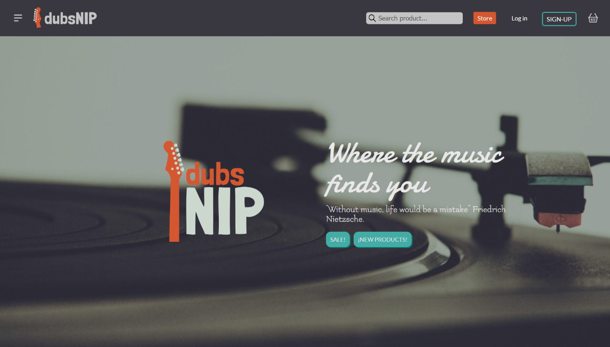
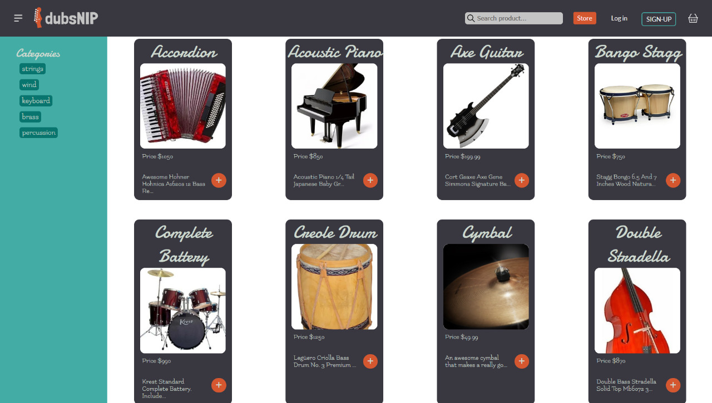
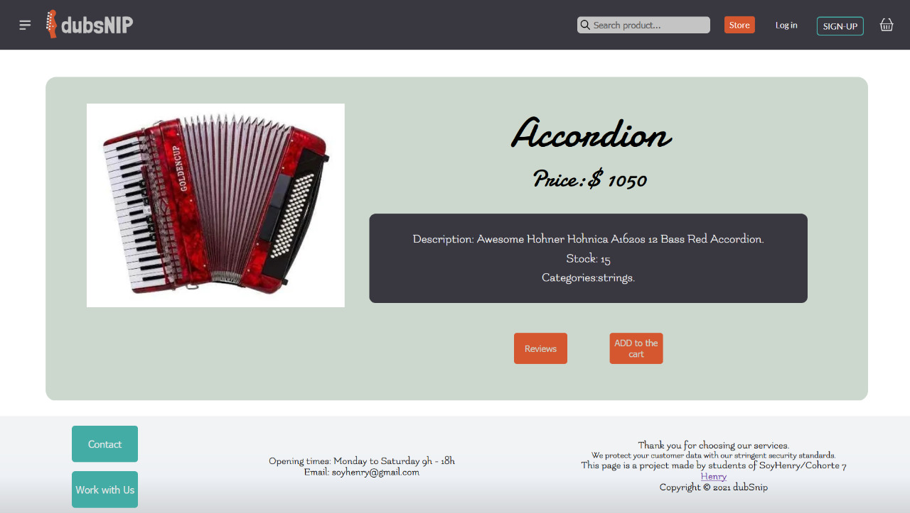
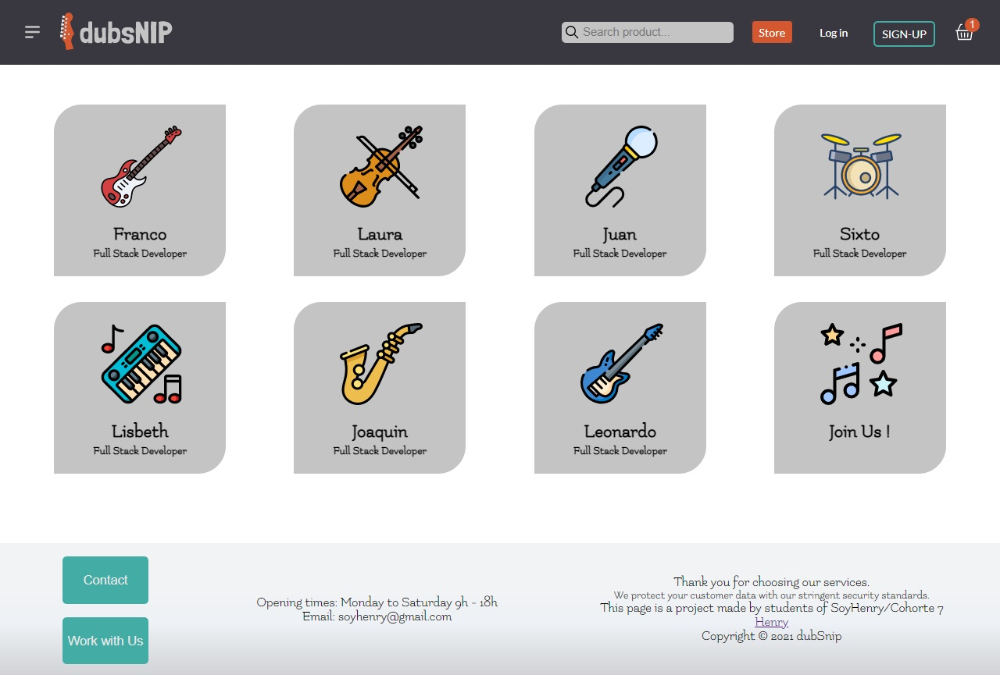

# 🎸 DubsNip

It is a website created as a project for Henry. It is a music store where you can find your favorite items and buy them through Mercado Pago.
You can browse it as a guest, registered user or store administrator.

## 💻 Demo of Working Project

<h1 align="center">
  
  
  
</h1>

Our app is deployed in Heroku and Vercel, so you can view it in your browser clicking
<a href="https://dubsnip.dubsnip.vercel.app/" target="_blank" rel="noreferrer">🎵 HERE🎵</a> to see the DEMO.

<br>

# 🎼 Back-End

- To build the Back, we used **_PostgreSQL_** and **_Sequelize_**, from there we created all the necessary tables to structure the content.

- With the help of **_Express_** we created all the routes to connect the information and to be able to implement the CRUDS in the Front.

- And finally with **_Passport_**, we proceeded to protect these routes and implement a registration system that allows the user to join the page.

<br>

# 🎶 Front-End

The Front was developed with **_React_**, and **_Redux_** to optimize the processes. It has the following components

### 🔎 SearchBar

It has a **controlled** form with a search input, which triggers requests to the API in the Back-end.

### 📁 Catalog

This component will display a series of products (obtained from the API) using the product card. It also allows you to sort the products according to categories.
Each card will show the image, title, price and available stock.

### 💰 Cart

It has a shopping cart to add products and shows details of the purchase, it will redirect to the payment platform to purchase them.

### 🐶 Users

It has specific features for each type of user.
As a guest, you can browse through the Store and add products to your cart.
As a registered user, you can make purchases and track your orders.
As an administrator, you have full permissions to add, edit and delete products, categories, stock, among others.

<br>

# 🚀 Installation

- Fork the repo into your GitHub account or clone it on your PC.

```bash
git clone https://github.com/Lis-cyber/DubsNip.git
```

- Then you must install all the dependencies on both, the back (api folder) and the front end (client folder).

```bash
npm install
```

- You must ensure that your version of Node is equal to or greater than V.14.

```bash
node -v
```

- In api and client you will have to create a file named: .env with the following form, filling each one of the variables:

```bash
DB_USER=userPostgreSQL
DB_PASSWORD=passwordPostgreSQL
DB_HOST=localhostPostgreSQL
PORT=1337
JWT_SECRET
GOOGLE_CLIENT_ID
GOOGLE_CLIENT_SECRET
MAILGUN_API_KEY
MAILGUN_DOMAIN
MERCADOPAGO_ACCESS_TOKEN
API_URL=http://localhost:1337
CLIENT_URL=http://localhost:3000
```

- Finally initialize the App with the following command in both terminals.

```bash
npm start
```

<br>

## 🐙 Contributors

<span align="left">
  
  <a href="https://github.com/lis-cyber" target="_blank" rel="noreferrer">
    <p> --> 🎹 Lis Jardim </p>
  </a>
  <a href="https://github.com/sacunap" target="_blank" rel="noreferrer">
    <p> --> 🥁 Sixto Acuña </p>
  </a>
  <a href="https://github.com/laupucci" target="_blank" rel="noreferrer">
    <p> --> 🎻 Laura Puccinelli </p>
  </a>
  <a href="https://github.com/francoasc" target="_blank" rel="noreferrer">
    <p> --> 🎸 Franco Ascarate </p>
  </a>
  <a href="https://github.com/jucaran" target="_blank" rel="noreferrer">
    <p> --> 🎤 Juan Arancibia </p>
  </a>
  <a href="https://github.com/joafran" target="_blank" rel="noreferrer">
    <p> --> 🎷 Joaquin Franco </p>
  </a>
</span>
